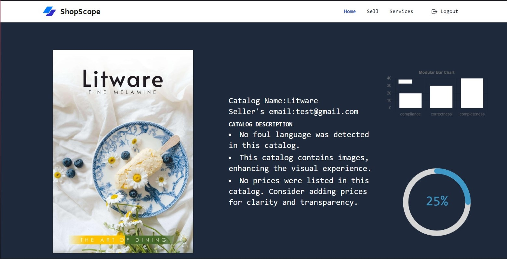

<!-- ABOUT THE PROJECT -->
# ShipScope


This is a cataloging scoring system with a marketplace, making it a perfect pitstop before you enter the market place.
It is a full stack application Frontend is built with `React` and for backend with `Node` and python server using `FastAPI`.

Use the `README.md` to get started.

<!-- BUILT WITH -->
# Built With

The Tech Stacks used are:

<div align="center">
  <a href="https://skillicons.dev">
      
  </a>
</div>

## Installation

1. Clone the repository to your local machine:

   ```bash
   git clone https://github.com/Chetan3327/innohacks-2024.git
   ```
2. Navigate to the frontend directory:

   ```bash
   cd frontend
   ```
3. Install dependencies:

   ```bash
   npm install
   ```
4. Navigate to the backend directory:

   ```bash
   cd backend
   ```
5. Install dependencies:

   ```bash
   npm install
   ```
4. Navigate to the backend_python directory:

   ```bash
   cd backend_python
   ```
5. Install dependencies:

   ```bash
   pip install -r requirements.txt
   ```

Project Link: https://shopscope.netlify.app/

## Credits
List of contriubutors:
<ul>
  <li><a href="https://github.com/chetan3327">Chetan Chauhan</a></li>
  <li><a href="https://github.com/moracus">Harsh Sharma</a></li>
  <li><a href="https://github.com/sanchitaa14">Sanchita Bhardwaj</a></li>
  <li><a href="https://github.com/AayushiV07">Ayushi</a></li>
</ul>